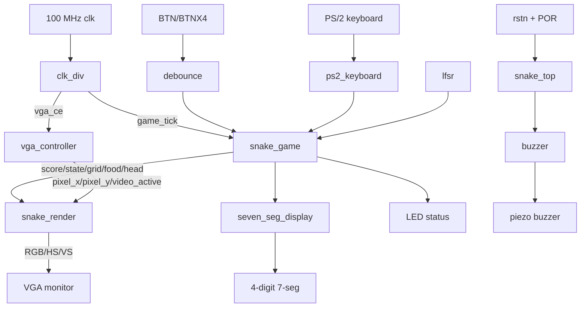
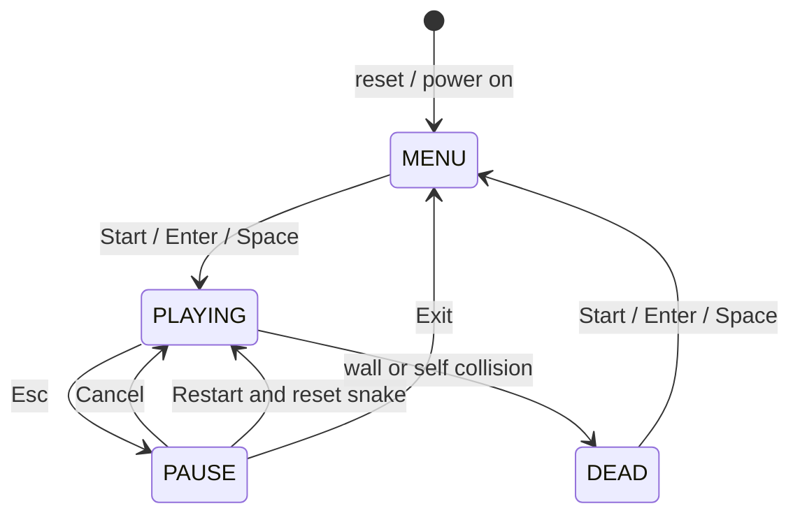

# 基于 Kintex-7 FPGA 的贪吃蛇游戏设计报告

成员：

- 3250104400 王笑
- 3220103349 毛毅

Date: 2026-07-03

## 一、背景介绍

本课程设计要求在 Sword Kintex7 实验平台上使用 Verilog HDL 设计一个具有完整功能的时序电路，要求包含状态机、寄存器访问、存储结构和适当的人机交互 I/O，并鼓励使用 PS/2、VGA 等扩展接口实现更直观的交互界面。

本项目选择实现经典贪吃蛇游戏。贪吃蛇虽然规则简单，但在 FPGA 上完整实现时需要同时处理游戏状态机、蛇身存储、随机食物生成、碰撞检测、VGA 图像输出、按键/键盘输入、数码管计分、LED 状态提示和蜂鸣器音乐播放等多个模块，能较全面地体现数字逻辑设计中的时序控制、组合逻辑、状态机、外设接口和仿真验证能力。

系统上电后进入 `SNAKE!` 开始界面，玩家可选择 Easy、Normal、Hard 三档难度；开始游戏后通过板载按钮或 PS/2 键盘控制蛇移动，吃到食物后分数增加并使蛇身变长；撞墙或撞到自身后进入 `GAME OVER` 界面并显示最终分数；游戏中按 `Esc` 可进入暂停菜单，支持重新开始、继续游戏和退出到主菜单。当前版本已将 `buzzer.v` 接回顶层，可通过蜂鸣器循环播放背景音乐，暂停时静音。

## 二、设计说明

### A. 设计开发环境

| 项目 | 内容 |
| --- | --- |
| 实验平台 | Sword Kintex7 FPGA 实验平台 |
| 开发环境 | Xilinx Vivado |
| 硬件描述语言 | Verilog HDL |
| 主时钟 | 100 MHz |
| 显示输出 | VGA 640x480、RGB 4:4:4；4 位 7 段数码管；8 位 LED |
| 输入接口 | 板载 BTN/BTNX4 按钮；PS/2 键盘 |
| 音频输出 | 蜂鸣器方波音乐输出 |

### B. 输入输出交互选择

输入部分包括：

- `BTN[3:0]`：板载方向按钮，分别对应上、下、左、右。
- `BTNX4`：开始/确认按钮。
- `rstn`：低有效外部复位。
- `ps2_clk`、`ps2_data`：PS/2 键盘接口，支持方向键、WASD、Enter、Space 和 Esc。

输出部分包括：

- VGA：显示开始菜单、游戏画面、暂停菜单、死亡界面、分数和历史最高分。
- 4 位 7 段数码管：实时显示当前 BCD 分数。
- LED：显示游戏状态、死亡状态、心跳、菜单状态、难度和游戏节拍。
- `buzzer`：输出背景音乐方波，暂停菜单打开时静音。

LED 状态定义如下：

| LED | 对应状态 | 点亮/变化含义 |
| --- | --- | --- |
| `LED[0]` | 游戏进行状态 | 当前处于游戏中且未死亡、未在主菜单时点亮 |
| `LED[1]` | 游戏结束状态 | 进入 `GAME OVER` 死亡界面时点亮 |
| `LED[2]` | 系统心跳 | 由计数器分频产生约 1.5 Hz 闪烁，用于确认系统时钟正常运行 |
| `LED[3]` | 主菜单状态 | 当前处于 `S_MENU` 主菜单时点亮 |
| `LED[4]` | 难度 bit0 | 显示当前难度编码最低位 |
| `LED[5]` | 难度 bit1 | 显示当前难度编码最高位；`LED[5:4]` 为 `00` 表示 Easy，`01` 表示 Normal，`10` 表示 Hard |
| `LED[6]` | 分数状态 | 当前分数非 0 时点亮 |
| `LED[7]` | 游戏节拍 | 直接输出 `game_tick` 脉冲，用于观察游戏基础更新节拍 |

课程设计要求中提到基本输入可使用 SW、BTN。本项目当前 RTL 未使用 SW 拨动开关，而是采用 BTN 与 PS/2 键盘作为主要输入；输出覆盖 LED、4 位 7 段数码管，并扩展实现 VGA 与蜂鸣器。

### C. 总体功能

1. 40 x 30 游戏网格，每格 16 x 16 像素，正好对应 640 x 480 VGA 可见区域。
2. 四状态游戏状态机：主菜单、游戏中、暂停菜单、死亡界面。
3. 三档难度：Easy、Normal、Hard，通过改变有效移动 tick 的分频比例控制速度。
4. 蛇身初始长度为 3，最大长度为 256。
5. 食物由 16 位 LFSR 伪随机生成，生成时避开蛇身。
6. 支持撞墙、自碰撞检测；允许蛇头进入即将移走的尾巴格，避免误判。
7. 分数采用 4 位 BCD，范围为 0000 至 9999。
8. Easy、Normal、Hard 分别保存本次上电后的最高分。
9. VGA 使用内置 5 x 7 点阵字体显示英文菜单和分数。
10. 主菜单包含动态环绕小蛇，动画速度随难度变化。
11. 蜂鸣器循环播放 Korobeiniki/Tetris Type A 风格旋律。

## 三、模块结构

### A. 各模块关系图



### B. `snake_top` 顶层模块

`snake_top.v` 是系统顶层，负责连接全部子模块。其主要功能如下：

- 产生上电复位 `por_rst`，并与外部低有效复位 `rstn` 合并。
- 例化 `clk_div`，产生 VGA 扫描用 `vga_ce` 和游戏逻辑用 `game_tick`。
- 对板载按钮进行消抖，并将低有效按钮转换为高有效脉冲。
- 接入 PS/2 键盘控制器。
- 将按钮输入与键盘输入按 OR 方式合并。
- 例化游戏核心、VGA 时序、渲染、数码管、蜂鸣器和 LED 状态输出。

顶层主要端口如下：

| 端口 | 方向 | 说明 |
| --- | --- | --- |
| `clk` | input | 100 MHz 系统时钟 |
| `rstn` | input | 低有效复位 |
| `BTN[3:0]` | input | 上、下、左、右方向按钮 |
| `BTNX4` | input | 开始/确认按钮 |
| `ps2_clk`, `ps2_data` | input | PS/2 键盘接口 |
| `r[3:0]`, `g[3:0]`, `b[3:0]` | output | VGA RGB 输出 |
| `hs`, `vs` | output | VGA 行、场同步 |
| `AN[3:0]`, `SEGMENT[7:0]` | output | 4 位 7 段数码管 |
| `LED[7:0]` | output | 状态指示灯 |
| `buzzer` | output | 蜂鸣器输出 |

### C. `snake_game` 游戏核心模块

`snake_game.v` 是项目核心，负责状态机、蛇身更新、碰撞检测、食物生成、计分、最高分记录和难度控制。

主要内部结构如下：

- `state`：当前游戏状态。
- `snake_x[]`、`snake_y[]`：蛇身坐标数组，构成环形 FIFO。
- `head_idx`、`tail_idx`：蛇头写入位置和蛇尾读取位置。
- `snake_len`：当前蛇长。
- `grid_reg[1199:0]`：40 x 30 网格占用位图，用于快速判断蛇身占用。
- `current_dir`、`next_dir`：当前已提交方向和下一步方向。
- `difficulty_reg`：当前难度。
- `score_reg`：当前 BCD 分数。
- `high_easy_reg`、`high_normal_reg`、`high_hard_reg`：分难度最高分。

蛇移动时，模块先根据 `next_dir` 计算新蛇头坐标，再判断撞墙和自碰撞。若没有碰撞，则写入新蛇头；如果吃到食物，则蛇长加一并保留尾巴；否则删除旧尾巴并移动 `tail_idx`。

### D. `vga_controller` VGA 时序模块

`vga_controller.v` 产生 640 x 480 @ 60 Hz 等效 VGA 时序。系统不单独产生 25 MHz 时钟，而是在 100 MHz 主时钟下使用 `vga_ce` 作为像素使能，避免额外时钟域。

关键时序参数如下：

| 项目 | 数值 |
| --- | --- |
| 水平可见区 | 640 |
| 水平前沿 | 16 |
| 水平同步 | 96 |
| 水平后沿 | 48 |
| 水平总周期 | 800 |
| 垂直可见区 | 480 |
| 垂直前沿 | 10 |
| 垂直同步 | 2 |
| 垂直后沿 | 33 |
| 垂直总周期 | 525 |

### E. `snake_render` VGA 渲染模块

`snake_render.v` 根据当前像素坐标和游戏状态决定 RGB 输出。它将像素坐标通过位切片转换为网格坐标：

```verilog
cell_x = pixel_x[9:4];
cell_y = pixel_y[9:4];
```

由于每格为 16 像素，使用位切片即可完成除以 16 的运算，硬件代价低。

渲染内容包括：

- 游戏背景、边框、网格线。
- 红色食物。
- 蓝色蛇头、绿色蛇身。
- 左上角实时 `SCORE`。
- `SNAKE!` 主菜单、难度选择、最高分、历史记录和闪烁 START。
- 主菜单动态环绕小蛇。
- `PAUSE` 暂停菜单和选中项边框。
- `GAME OVER` 死亡界面和最终分数。

### F. `ps2_keyboard` 键盘模块

`ps2_keyboard.v` 解析 PS/2 扫描码。模块对 `ps2_clk` 和 `ps2_data` 做两级同步，在 PS/2 时钟下降沿接收帧数据。每帧包含起始位、8 位数据、奇校验位和停止位。

按键映射如下：

| 按键 | 扫描码 | 功能 |
| --- | --- | --- |
| Up | `E0 75` | 向上 |
| Down | `E0 72` | 向下 |
| Left | `E0 6B` | 向左 |
| Right | `E0 74` | 向右 |
| W | `1D` | 向上 |
| S | `1B` | 向下 |
| A | `1C` | 向左 |
| D | `23` | 向右 |
| Enter | `5A` | 开始/确认 |
| Space | `29` | 开始/确认 |
| Esc | `76` | 暂停/取消 |

### G. `seven_seg_display` 数码管模块

`seven_seg_display.v` 驱动 4 位共阳极 7 段数码管。输入 `score[15:0]` 被解释为 4 位 BCD 数字，动态扫描显示个位、十位、百位和千位。

### H. `buzzer` 蜂鸣器模块

`buzzer.v` 实现简单音乐播放器和方波音调发生器。模块包括：

- 节拍计数器：100 ms 为一个十六分音符单位。
- 歌曲 ROM：保存音符和持续时间。
- 频率查找表：将 C4 到 B5 的音符映射为半周期计数值。
- 方波发生器：按照半周期计数翻转输出。

顶层中 `enable = ~pause_active`，因此暂停菜单打开时音乐静音，离开暂停菜单后重新开始播放。

### I. 其他辅助模块

| 模块 | 作用 |
| --- | --- |
| `clk_div.v` | 产生 `vga_ce` 和 `game_tick` 使能脉冲 |
| `debounce.v` | 板载按钮消抖，输出单周期按下/释放脉冲 |
| `lfsr.v` | 16 位 Galois LFSR，产生伪随机数用于食物坐标 |

## 四、程序流程

### A. 游戏状态机流程



四个状态含义如下：

| 状态 | 含义 |
| --- | --- |
| `S_MENU` | 主菜单，选择难度并显示最高分 |
| `S_PLAYING` | 游戏进行，按 tick 更新蛇的位置 |
| `S_PAUSE` | 暂停菜单，可继续、重开或退出 |
| `S_DEAD` | 死亡界面，显示最终分数并等待确认 |

### B. 蛇移动流程

```text
game_tick 到来
  |
  v
根据 next_dir 计算 new_head_x/new_head_y
  |
  v
判断是否撞墙或撞到蛇身
  |
  +-- 碰撞 --> collision_flag=1，进入 DEAD
  |
  +-- 未碰撞 --> 写入新蛇头
                  |
                  +-- 吃到食物 --> 分数+1，蛇长+1，食物失效等待重生
                  |
                  +-- 未吃食物 --> 删除旧蛇尾，tail_idx+1
```

### C. 食物生成流程

1. `lfsr` 每个时钟周期更新伪随机数。
2. `snake_game` 取 LFSR 的部分位映射成候选坐标。
3. 若候选坐标超出范围，则减去对应边界值映射回 40 x 30 网格。
4. 若候选格被蛇身占用，则本周期不生成，等待下一周期新候选值。
5. 若候选格为空，则写入 `food_x_reg`、`food_y_reg` 并置 `food_valid=1`。

### D. 方向控制流程

方向控制采用 `current_dir` 和 `next_dir` 两级寄存器。`current_dir` 表示上一次实际移动方向，`next_dir` 表示下一次移动要使用的方向。输入合法性始终相对 `current_dir` 判断，因此可以避免在同一移动 tick 前快速连续按键导致非法 180 度掉头。

例如蛇当前向上，玩家快速按右、下：

- 右相对当前向上合法，`next_dir` 更新为右。
- 下相对当前向上是反向，被忽略。
- 下一次移动向右，不会立刻撞到自身。

## 五、调试过程分析

### A. 综合与结构检查

设计完成后，首先检查顶层端口与约束文件的一致性。`constraints/snake_k7.xdc` 中给出了 100 MHz 时钟、复位、方向按钮、PS/2、VGA、LED、蜂鸣器和 7 段数码管引脚约束。顶层 `snake_top.v` 中所有主要外设均有对应端口。

其次检查单时钟域设计。除 PS/2 输入先同步外，系统主要逻辑均在 100 MHz `clk` 下运行，低频更新通过 clock enable 控制，没有引入门控时钟，降低了跨时钟域风险。

### B. 调试重点

1. 复位后是否进入主菜单。顶层使用 POR 计数器加外部复位，游戏核心复位状态为 `S_MENU`。
2. VGA 时序是否稳定。`vga_controller` 使用标准 640 x 480 参数，并只在 `vga_ce` 有效时推进像素计数。
3. 按钮是否误触发。`debounce` 约 1 kHz 采样，要求 16 次稳定采样后才输出脉冲。
4. PS/2 是否正确识别扩展码和断码。键盘模块使用 `E0` 和 `F0` 标志区分扩展键与释放码。
5. 蛇身位图是否与坐标 FIFO 保持一致。通过 `grid_reg` 快速判断占用，通过 `head_idx`、`tail_idx` 维护顺序。
6. 蛇头进入旧尾巴格时是否误判。代码中使用 `moving_into_tail` 对该情况单独处理。
7. 死亡后是否停留在 `GAME OVER`，而不是立刻回到菜单。
8. 暂停菜单三项是否正确切换和执行。
9. 蜂鸣器是否正确接回顶层，并在暂停时静音。

### C. 操作过程

1. 上电或按复位后进入主菜单。
2. 在主菜单中按上/左切换到更低难度，按下/右切换到更高难度。
3. 按 `BTNX4`、`Enter` 或 `Space` 开始游戏。
4. 游戏中通过 `BTN[3:0]` 或方向键/WASD 控制移动。
5. 吃到红色食物后，分数加 1，蛇身增长一节。
6. 游戏中按 `Esc` 打开暂停菜单。
7. 暂停菜单中通过方向键选择 `RESTART`、`CANCEL` 或 `EXIT`，按确认键执行。
8. 撞墙或自碰后进入死亡界面，按确认键返回主菜单。

### D. 引脚与功能定义

| 类型 | 信号 | 功能 |
| --- | --- | --- |
| 输入 | `rstn` | 低有效复位 |
| 输入 | `BTN[0]` | 向上 |
| 输入 | `BTN[1]` | 向下 |
| 输入 | `BTN[2]` | 向左 |
| 输入 | `BTN[3]` | 向右 |
| 输入 | `BTNX4` | 开始/确认 |
| 输入 | `ps2_clk`, `ps2_data` | PS/2 键盘 |
| 输出 | `r/g/b`, `hs`, `vs` | VGA 显示 |
| 输出 | `AN`, `SEGMENT` | 数码管显示分数 |
| 输出 | `LED[0]` | 游戏进行中 |
| 输出 | `LED[1]` | 游戏结束 |
| 输出 | `LED[2]` | 心跳灯 |
| 输出 | `LED[3]` | 主菜单状态 |
| 输出 | `LED[4:5]` | 当前难度编码 |
| 输出 | `LED[6]` | 分数非零 |
| 输出 | `LED[7]` | `game_tick` 脉冲 |
| 输出 | `buzzer` | 背景音乐 |

## 六、核心模块模拟仿真结果

### A. 仿真环境

项目提供 `sim/snake_tb.v` 作为行为仿真测试平台。测试平台使用 `defparam` 加速硬件参数：

| 参数 | 硬件值 | 仿真值 | 说明 |
| --- | --- | --- | --- |
| `GAME_TICK_DIV` | 19,999,999 | 99 | 将游戏 tick 从约 200 ms 加速到约 1 us |
| `SAMPLE_MAX` | 99,999 | 9 | 加速按钮消抖采样 |

### B. 仿真覆盖内容

测试平台覆盖以下关键场景：

1. 上电复位后进入主菜单。
2. PS/2 方向键切换难度。
3. PS/2 Enter 从主菜单进入游戏。
4. `R` 键不再打开游戏菜单。
5. `Esc` 打开暂停菜单。
6. 暂停菜单 `CANCEL` 返回游戏。
7. 暂停菜单 `RESTART` 重置蛇身和分数并继续游戏。
8. 暂停菜单 `EXIT` 返回主菜单。
9. 板载按钮控制方向。
10. 反向输入被忽略。
11. 撞墙后进入 `GAME OVER`，并等待确认。
12. 蛇头移动到旧尾巴格时保持网格一致。
13. 连续方向输入时保留最后一个相对当前方向合法的输入。
14. 主菜单环绕小蛇轨道闭合且相邻点连续。

### C. 仿真输出摘录

```text
=== Snake Game Testbench Start ===
[5500000] POR done, start menu is visible
[5500000] Selecting HARD difficulty via PS/2 RIGHT...
[1328500000] Selecting EASY difficulty via PS/2 LEFT...
[3973500000] Pressing PS/2 ENTER to enter game...
[4645500000] Snake moved right from default direction
[4645500000] Pressing R (should no longer open a menu)...
[5307500000] Pressing ESC to open pause menu...
[5969500000] Pressing ENTER to cancel pause menu...
[6631500000] Pressing ESC and choosing RESTART...
[9277500000] Pressing ESC and choosing EXIT...
[11923500000] Restarting from title after pause EXIT...
[12585500000] Pressing DOWN...
[12605500000] Snake should now be moving DOWN
[12605500000] Pressing UP (should be ignored; 180 turn blocked)...
[12625500000] Snake should STILL be moving DOWN
[12625500000] Pressing RIGHT...
[12645500000] Snake should now be moving RIGHT
[12645500000] Pressing UP...
[12665500000] Snake should now be moving UP
[12665500000] Waiting for snake to hit wall...
[12748575000] *** GAME OVER! (LED[1]=1) ***
[12765500000] Snake died and GAME OVER is visible
[12815500000] Pressing START to acknowledge GAME OVER...
[12826500000] Pressing START from menu after game-over confirm...
[12846500000] Snake restarted, moving RIGHT
[12846500000] Checking tail-follow grid retention...
[12846606000] Tail-follow grid retention passed
[12846606000] Checking queued direction keeps last valid input...
[12866616000] Queued direction retention passed
[12866616000] Checking title snake orbit continuity...
[12866616000] Title snake orbit continuity passed
=== Snake Game Testbench Complete ===
Smoke checks passed; inspect waveform for score and direction details.
```

仿真结果表明，当前 RTL 在行为仿真层面通过了主菜单、键盘输入、暂停菜单、死亡确认、方向控制、蛇身尾随和主菜单动画连续性等核心检查。

### D. 波形说明

使用 Vivado 仿真，重点观察以下信号：

- `u_dut.menu_active`、`u_dut.pause_active`、`u_dut.game_over`：状态切换。
- `u_dut.score`：吃到食物后的 BCD 分数。
- `u_dut.u_game.current_dir`、`u_dut.u_game.next_dir`：方向提交和方向队列。
- `u_dut.u_game.head_x_reg`、`u_dut.u_game.head_y_reg`：蛇头坐标。
- `u_dut.u_game.grid_reg`：蛇身位图。
- `u_dut.LED`：状态灯输出。

整体波形如下，具体事件参考上述输出：


## 七、程序代码说明

项目源代码位于 `rtl/` 目录：

| 文件 | 说明 |
| --- | --- |
| `snake_top.v` | 顶层集成模块 |
| `snake_game.v` | 游戏核心逻辑 |
| `snake_render.v` | VGA 图像渲染 |
| `vga_controller.v` | VGA 时序控制 |
| `ps2_keyboard.v` | PS/2 键盘解析 |
| `seven_seg_display.v` | 4 位 7 段数码管驱动 |
| `buzzer.v` | 蜂鸣器音乐播放器 |
| `clk_div.v` | 时钟使能生成 |
| `debounce.v` | 按钮消抖 |
| `lfsr.v` | 伪随机数发生器 |

约束文件位于 `constraints/snake_k7.xdc`，仿真文件位于 `sim/snake_tb.v`。

核心代码片段示例：

```verilog
// 游戏状态
localparam S_MENU    = 2'd0;
localparam S_PLAYING = 2'd1;
localparam S_DEAD    = 2'd2;
localparam S_PAUSE   = 2'd3;
```

```verilog
// 三档难度对应移动分频
wire [2:0] move_div_limit =
    (difficulty_reg == 2'd0) ? 3'd3 :
    (difficulty_reg == 2'd1) ? 3'd1 :
                               3'd0;
```

```verilog
// 自碰撞检测，允许进入即将移走的尾巴格
wire moving_into_tail = in_bounds && !will_grow && (new_head_idx == tail_cell_idx);
wire self_collision = in_bounds ? (grid_reg[new_head_idx] && !moving_into_tail) : 1'b0;
```

```verilog
// 顶层蜂鸣器连接：暂停时静音
buzzer u_buzzer (
    .clk        (clk),
    .rst        (rst),
    .enable     (~pause_active),
    .buzzer_out (buzzer)
);
```

完整代码较长，提交时应包含整个 Vivado Project、`rtl/` 源码、`constraints/` 约束文件、仿真文件和生成的目标流代码。

## 八、组内成员分工说明及贡献比例


成员分工：

| 成员 | 主要工作 |
| --- | --- |
| 王笑 | 顶层集成、蛇身存储与碰撞检测、PS/2 键盘、数码管、蜂鸣器、VGA 时序、图像渲染 |
| 毛毅 | 菜单界面、字体显示、游戏核心状态机、图像渲染、仿真测试与报告整理 |

贡献比例：

| 身份 | 学号 | 姓名 | 贡献比例 |
| --- | --- | --- | --- |
| 组长 | 3250104400 | 王笑 | 50% |
| 组员 | 3220103349 | 毛毅 | 50% |

## 九、总结

本项目在 Kintex-7 FPGA 平台上实现了一个完整的贪吃蛇游戏系统。设计中使用四状态时序状态机组织游戏流程，用坐标 FIFO 和 1200 位网格位图管理蛇身，用 LFSR 产生随机食物，用 VGA 时序和渲染模块提供图形界面，用 7 段数码管和 LED 输出状态信息，并通过 PS/2 键盘和板载按钮实现人机交互。同时，项目加入了三档难度、分难度最高分、暂停菜单、死亡确认界面、主菜单动画和蜂鸣器背景音乐，使系统具有较完整的可玩性和演示效果。

从数字逻辑课程设计角度看，本项目覆盖了状态机设计、寄存器读写、ROM/查找表、类 RAM 存储结构、VGA 显示时序、外设接口、按钮消抖、伪随机数生成、动态数码管扫描和行为仿真验证等内容，基本满足课程设计对完整时序系统和人机交互功能的要求，并通过 PS/2、VGA 和蜂鸣器扩展增强了系统表现力。
